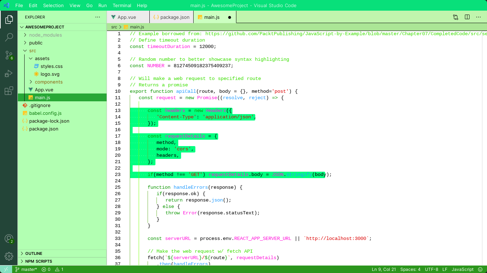

<p align="center">
  
</p>
<h1 align="center">
  Verdure: VS Code Color Theme
</h1>
<p align="center">
  <a href="https://verdure.netlify.com/">Verdure</a> is VS Code color theme inspired by the enchanting green color of a Matcha Latte 💚
</p>



## How to Install via VS Code

1. Open **Extensions** sidebar panel in VS Code. `View → Extensions`
2. Search for `Verdure`
3. Click **Install** to install it
4. Click **Reload** to reload the editor
5. Code > Preferences > Color Theme > **Verdure**

## Color Reference

### Syntax Colors

|                               Color                                | Usage                                           |
| :----------------------------------------------------------------: | ----------------------------------------------- |
|  `#0c9600` | Keywords, constants, template literals          |
|  `#269dff` | Functions, classes, object literal keys         |
|  `#ff11da` | Constants, operators                            |
|  `#db0000` | Strings, markdown headings                      |
|  `#0c9600` | Special keywords, classes, markdown code blocks |
|  `#000000` | Variables, property names, tags                 |

### UI Colors

|                               Color                                | Usage                                      |
| :----------------------------------------------------------------: | ------------------------------------------ |
|  `#90ee90` | Workbench background                       |
|  `#ffffff` | Editor background                          |
|  `#8bf974` | Highlight, widgets, panels                 |
|  `#000000` | Dividers, subtle UI elements               |
|  `#2c961d` | Status bar, text, buttons, etc              |
|  `#d7dce2` | Active text, anything that should be white |
|  `#c2ffac` | Accent, list tree titles, badges, etc      |
|  `#bae67e` | Addition highlights                        |
|  `#ff0000` | Deletion highlights, errors, warnings      |
|  `#5ccfe6` | Modified highlights                        |

## Theming Reference

[VS Code Theme Color Reference](https://code.visualstudio.com/docs/getstarted/theme-color-reference)

[VS Code Theme Documentation](https://code.visualstudio.com/docs/extensions/themes-snippets-colorizers)

[VS Code Publishing Extensions](https://code.visualstudio.com/docs/extensions/publish-extension)

```bash
vsce publish patch/minor/major
```

## 👥 Author

👤 **Ada Rachel**

- GitHub: [@adarachel](https://github.com/adarachel)
- Twitter: [@adarachel](https://twitter.com/adarachel_dev)
- LinkedIn: [Ada Rachel Oyeoka](https://linkedin.com/in/adarachel)

## Check Out the Official site:

[verdure.com](https://verdure.netlify.app)

## ⭐️ Show your support

If you like this project please give it a star 😁🌟✨

## 🤝 Contributing <a name="contributing"></a>

Contributions, issues, and feature requests are welcome!

Feel free to check the [issues page](https://github.com/adarachel/verdure-vscode-theme/issues).

## 📝 License <a name="license"></a>

This project is [MIT](./LICENSE) licensed.

<p align="right">(<a href="#readme-top">back to top</a>)</p>